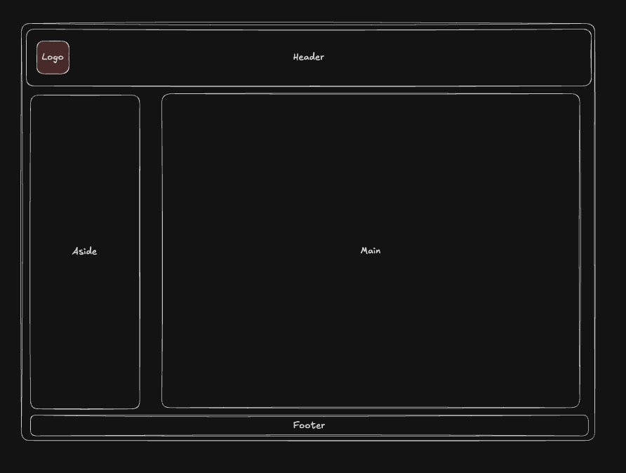
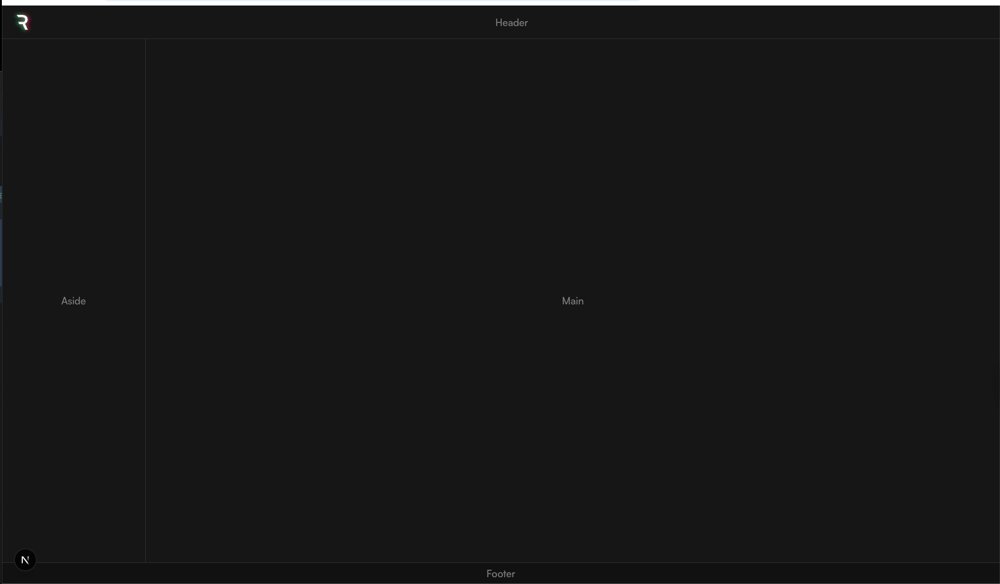
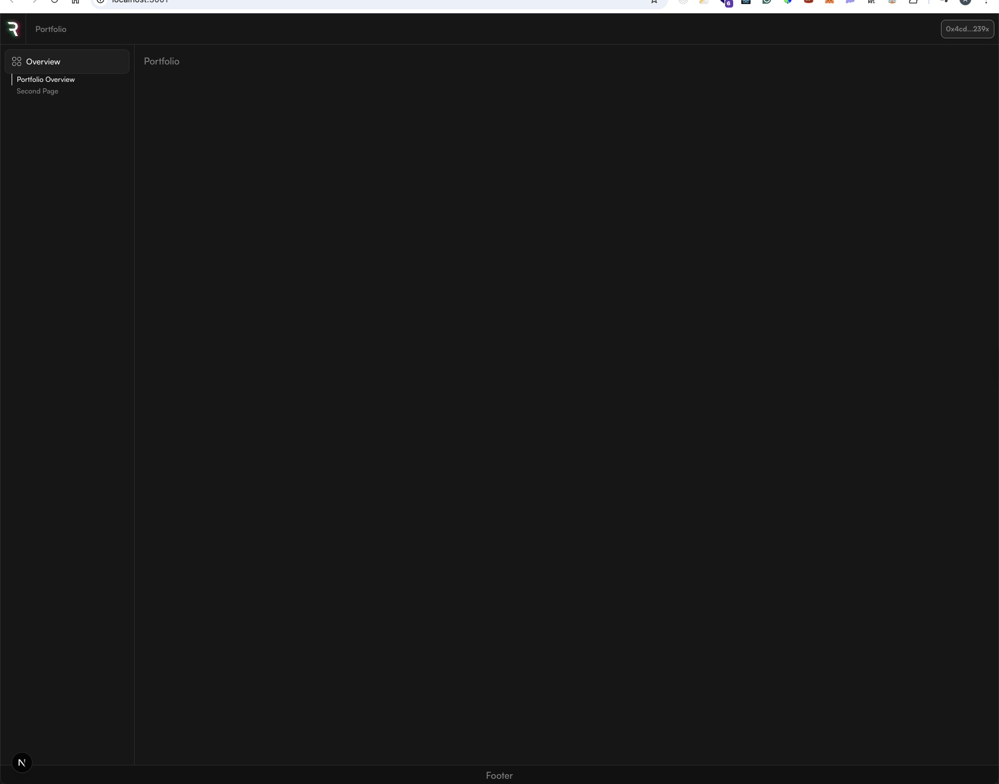
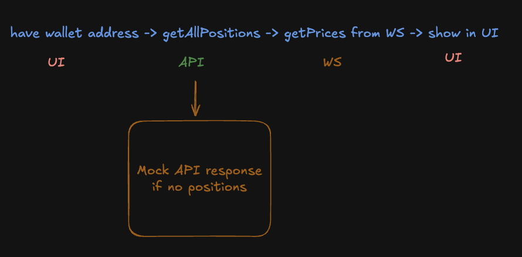
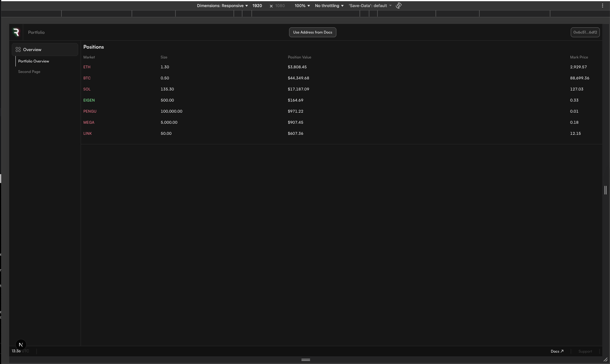

# Reya Portfolio

Assignment for Reya - Real-time portfolio viewer for Reya DEX positions.

## Requirements

- Node.js >= 18.18.0
- pnpm

## 🚀 Setup

```bash
pnpm install
pnpm dev
```

Open [http://localhost:3000](http://localhost:3000) and enter a wallet address to view positions.

## Code Quality

- [Biome](https://biomejs.dev/) for linting and formatting
- EditorConfig for consistent editor settings (line ending LF, indentation 2, spaces over tabs, etc.)

## 🔧 Solution Overview

### Real-Time Price Updates

The application uses WebSocket to receive real-time price updates from the Reya DEX API. Key implementation details:

1. **Batched Updates**: Incoming prices are buffered locally and flushed to the store every 1.5 seconds to prevent excessive re-renders
2. **Smart Diffing**: Only prices that have actually changed are dispatched to the store
3. **Direction Tracking**: Each price update calculates direction (up/down/neutral) for visual feedback
4. **Selective Subscriptions**: Each `PositionRow` component subscribes only to its specific symbol's price using a Zustand selector, preventing unnecessary re-renders when other prices change

### State Management

Zustand was chosen for its simplicity and performance:

```
walletStore
├── data
│   ├── walletAddress    # Current wallet being viewed
│   ├── positions        # Array of positions from API
│   ├── prices           # Record<symbol, MarketPrice> with direction
│   ├── loading/error    # UI states
│   └── isConnected      # WebSocket connection status
└── actions
    ├── updatePrices     # Batch update prices with direction calculation
    ├── setPositions     # Set positions from API response
    └── ...
```

### Design Decisions & Trade-offs

| Decision | Rationale | Trade-off |
|----------|-----------|-----------|
| 1.5s batch interval | Balances responsiveness with performance | Slight delay in price updates |
| Zustand over Redux | Simpler API, less boilerplate, built-in selectors | Less ecosystem/middleware |
| Client-side only | Simpler architecture for real-time data | No SSR for initial prices |
| Memo + selective selectors | Prevents cascade re-renders | Slightly more complex component code |

## Testing the Functionality

1. Run `pnpm dev` and open the app
2. Enter a wallet address with positions (or use mock data if API unavailable)
3. Observe the positions table updating with real-time prices
4. Price direction is indicated by color: green (up), red (down), gray (neutral)
5. Open DevTools → React DevTools to verify only affected rows re-render

## 🧪 Testing Strategy

No tests were implemented for this assignment, but here's the approach I would take:

**Testing Pyramid:**

1. **TypeScript** - Primary line of defense; strict typing prevents most runtime errors
2. **Unit Tests** - Pure functions (batching, formatters), co-located with source files
3. **Component Tests** - Vitest + React Testing Library for UI behavior
4. **E2E Tests** - Playwright/Cypress for critical paths only

## Deployment

The app is deployable to Vercel with zero configuration:

```bash
vercel
```

Considerations:
- Environment variables for API endpoints (production vs staging)
- WebSocket connections are client-side only, no special server config needed

## Monitoring Strategy

- **Error Tracking**: Sentry for runtime errors and WebSocket failures
- **Performance**: Web Vitals monitoring (LCP, FID, CLS)
- **WebSocket Health**: Track connection drops, reconnection frequency
- **API Latency**: Monitor position fetch and price update latency

## 📚 Tech Stack

- Next.js 16 with App Router
- Tailwind CSS for styling
- Zustand for state management
- Axios for API requests
- WebSocket for real-time price updates

Custom Tailwind colors were configured using [Name that Color](https://chir.ag/projects/name-that-color) for consistent naming.

## Structure

```
src/
├── app/           # Next.js app router pages
├── components/    # React components
├── constants/     # Static config and data
├── contexts/      # React context providers
├── services/      # API and WebSocket services
├── store/         # Zustand state management
└── types/         # TypeScript types
```

## 🔥 Development Progress

### Wireframe


### Initial Layout


### Layout with Navigation


### Data flow planning


### Testing positions re-rendering


### Final fixes

